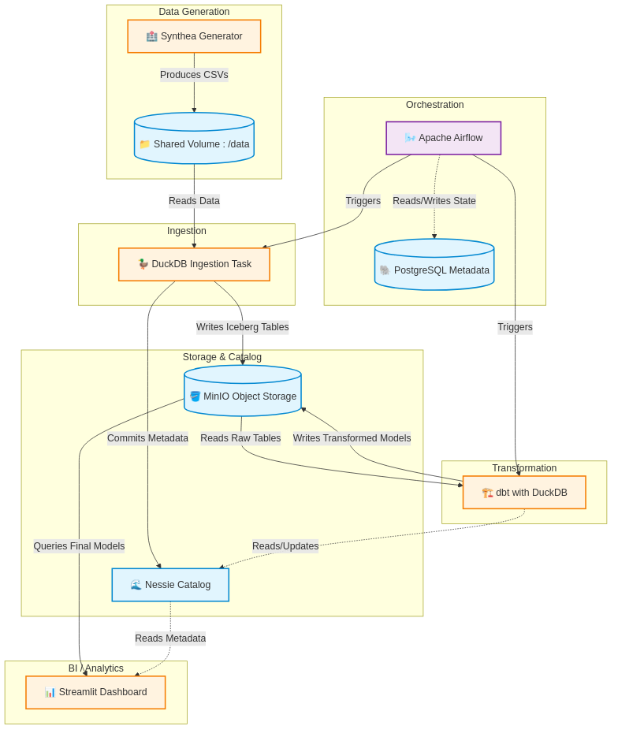

# Health Data Engineering Pipeline

## Overview

This project is a local Data Engineering pipeline designed to simulate, ingest, and transform healthcare data. It leverages a modern data stack running entirely in Docker:

- **Synthea**: Generates synthetic patient health records.
- **MinIO**: S3-compatible object storage.
- **Nessie**: Git-like catalog for Iceberg tables.
- **DuckDB**: In-memory analytical database for data ingestion and processing.
- **dbt**: Defines data transformation models.
- **Apache Iceberg**: Open table format for analytic datasets.

## Architecture



1.  **Generation**: Synthea container generates synthetic CSV data (patients, encounters, etc.) into a shared volume.
2.  **Orchestration**: Apache Airflow operates DAGs that orchestrate the pipeline logic.
3.  **Ingestion**: An Airflow task uses DuckDB to read the CSVs and write them as Iceberg tables to MinIO.
4.  **Transformation**: dbt (running with DuckDB) transforms the raw Iceberg tables into analytical models.

## Prerequisites

-   [Docker](https://docs.docker.com/get-docker/)
-   [Docker Compose](https://docs.docker.com/compose/install/)

## Getting Started

### 1. Start the Environment

First, define your environment variables by copying the example file:

```bash
cp env.example .env
```

Spin up the entire stack using Docker Compose:

```bash
docker-compose up -d
```

This will start MinIO, Nessie, the Synthea generator, Postgres, and the Airflow containers.

### 2. Generate Data

The `synthea` service automatically runs on startup and generates patient data into the `./data` directory. You can check the logs to see progress:

```bash
docker-compose logs -f synthea
```

### 3. Ingest Data to Iceberg

Once data is generated, log in to the Airflow UI at [http://localhost:8080](http://localhost:8080) (user: `admin`, password: `admin`). Enable and trigger the `healthcare_data_pipeline` DAG to execute data ingestion.

### 4. Run dbt Transformations

Run dbt models to transform the data:

```bash
docker-compose run dbt compile
# or
docker-compose run dbt run
```

## Project Structure

-   `docker-compose.yml`: Defines the multi-container Docker application.
-   `Dockerfile.airflow`: Custom Dockerfile for the Airflow services.
-   `Dockerfile.synthea`: Custom Dockerfile for the Synthea service.
-   `dags/`: Airflow DAG logic for data orchestration.
-   `dbt_project/`: The dbt project directory containing models and configuration.
-   `data/`: Shared volume where Synthea outputs raw CSV files (git-ignored).
-   `minio_data/`: Local storage for MinIO (git-ignored).

## Accessing Services

-   **MinIO Console**: [http://localhost:9001](http://localhost:9001)
    -   User: `admin`
    -   Password: `password123`
-   **Nessie API**: [http://localhost:19101/api/v1](http://localhost:19101/api/v1)
-   **Airflow UI**: [http://localhost:8080](http://localhost:8080)
    -   User: `admin`
    -   Password: `admin`

## Notes

-   The project uses a local MinIO instance to simulate S3.
-   Iceberg tables are stored in the `healthcare` bucket in MinIO.
