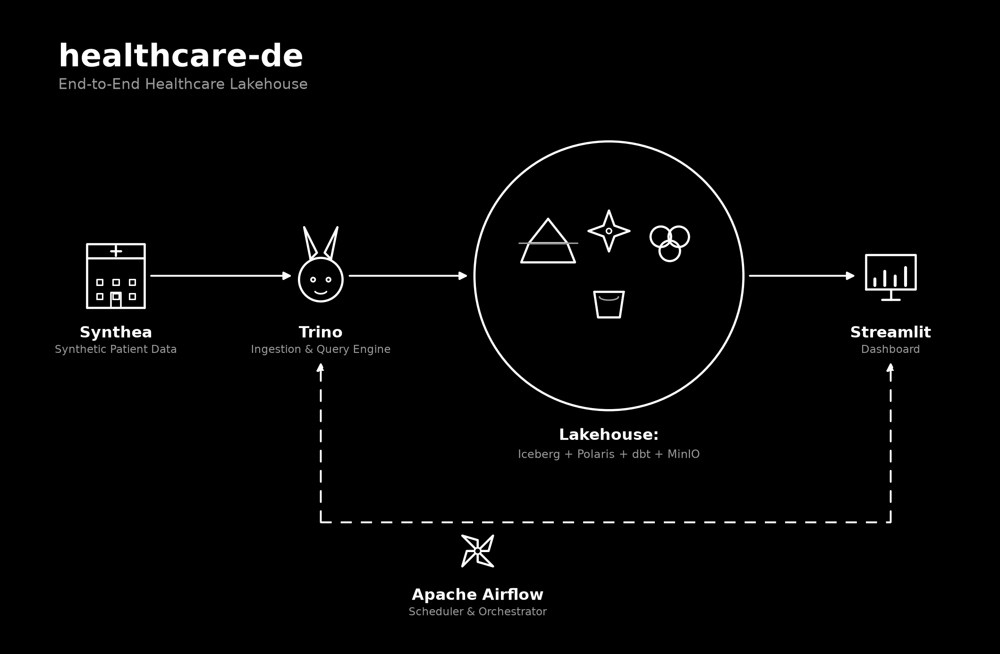

# Healthcare Data Engineering Pipeline

## Overview

A local data engineering pipeline that generates, ingests, and transforms synthetic healthcare data using a modern open lakehouse stack running entirely in Docker. The pipeline demonstrates two ingestion paths — structured CSV and FHIR R4 — to reflect real-world healthcare data engineering patterns.

**Stack:**

| Layer | Technology |
|---|---|
| Data generation | Synthea (CSV + FHIR R4) |
| Orchestration | Apache Airflow |
| Object storage | MinIO (S3-compatible) |
| Iceberg catalog | Apache Polaris (REST catalog) |
| Query engine | Trino |
| Transformation | dbt (dbt-trino) |
| Dashboard | Streamlit |

## Architecture



### Pipeline stages

**1. Generation**
Synthea generates synthetic patient records in two formats:
- CSV exports: patients, encounters, conditions
- FHIR R4 bundle JSON: one file per patient containing Patient, Encounter, and Condition resources

**2. Staging (Airflow + Python)**
Six staging tasks run in parallel. Each reads from the shared data volume and uploads Parquet files to MinIO at `s3://healthcare/staging/<table>/`.

CSV path:
- `patients.csv` → `staging/patients/`
- `encounters.csv` → `staging/encounters/`
- `conditions.csv` → `staging/conditions/`

FHIR R4 path:
- Patient resources + US Core race/ethnicity extensions → `staging/fhir_patients/`
- Encounter resources (v3-ActCode class, SNOMED type) → `staging/fhir_encounters/`
- Condition resources (SNOMED code, clinicalStatus, verificationStatus, onset/abatement) → `staging/fhir_conditions/`

**3. Ingestion (Trino → Polaris)**
Trino reads from Hive external tables over the MinIO staging Parquet and writes to Polaris-managed Iceberg tables via `CREATE OR REPLACE TABLE ... AS SELECT`. Polaris registers each table in the `iceberg.default` namespace from the moment of creation.

**4. Transformation (dbt + Trino)**
dbt models run against Trino, reading and writing within the Polaris catalog:

```
iceberg.default.patients          ──┐
iceberg.default.encounters          ├──▶ stg_* (staging)
iceberg.default.conditions          │         │
iceberg.default.fhir_patients       │         ▼
iceberg.default.fhir_encounters   ──┘   fct_patient_encounters (mart)
iceberg.default.fhir_conditions
```

**5. Serving**
- Streamlit dashboard queries Trino directly for clinical KPIs
- Trino CLI available for ad-hoc queries across all Polaris-registered tables

## Getting Started

### Prerequisites

- [Docker](https://docs.docker.com/get-docker/)
- [Docker Compose](https://docs.docker.com/compose/install/)

### 1. Configure environment

```bash
cp env.example .env
```

### 2. Start the stack

```bash
make up
```

Starts MinIO, Polaris, Synthea, Postgres, Airflow (webserver + scheduler), Trino, and the Streamlit dashboard. Polaris bootstrap runs automatically and creates the `default` catalog backed by `s3://healthcare/iceberg/`.

### 3. Run the pipeline

Trigger via the Airflow UI at [http://localhost:8080](http://localhost:8080) (admin / admin), or:

```bash
make trigger-ingest
```

The DAG runs the following task graph:

```
wait_for_synthea_data
  └── [stage_patients, stage_encounters, stage_conditions,
        stage_fhir_patients, stage_fhir_encounters, stage_fhir_conditions]
             └── create_staging_schema
                      └── [create_staging_patients, create_staging_encounters, ...]
                               └── [ingest_patients, ingest_encounters, ...]
```

### 4. Run dbt transformations

```bash
make dbt-run
```

To run tests:

```bash
make dbt-test
```

### 5. View the dashboard

```bash
make streamlit
```

Opens at [http://localhost:8501](http://localhost:8501). Shows patient demographics, encounter volume by month, top conditions by prevalence, encounter class mix, and average cost by encounter type.

### 6. Query with Trino

```bash
make trino-cli
```

Example queries:

```sql
-- All Polaris-registered tables
SHOW TABLES IN iceberg.default;

-- Compare CSV vs FHIR encounter counts per patient
SELECT
    c.patient_id,
    COUNT(DISTINCT c.encounter_id)  AS csv_encounters,
    COUNT(DISTINCT f.encounter_id)  AS fhir_encounters
FROM iceberg.default.encounters c
FULL OUTER JOIN iceberg.default.fhir_encounters f USING (patient_id)
GROUP BY 1
LIMIT 20;

-- Active conditions by clinical status (FHIR)
SELECT clinical_status, COUNT(*) AS condition_count
FROM iceberg.default.fhir_conditions
GROUP BY 1
ORDER BY 2 DESC;
```

## Project Structure

```
.
├── dags/
│   └── healthcare_pipeline.py   # Airflow DAG (staging + Trino ingest)
├── dbt_project/
│   ├── models/
│   │   ├── staging/             # stg_patients, stg_encounters, stg_conditions,
│   │   │                        # stg_fhir_patients, stg_fhir_encounters, stg_fhir_conditions
│   │   └── marts/               # fct_patient_encounters
│   └── profiles.yml             # dbt-trino connection
├── trino/
│   └── catalog/
│       ├── iceberg.properties   # Polaris REST catalog
│       └── file.properties      # Hive connector for MinIO staging
├── dashboard/
│   └── app.py                   # Streamlit (trino.dbapi)
├── polaris-bootstrap.sh         # Creates Polaris catalog on startup
├── docker-compose.yml
├── Dockerfile.airflow
├── Dockerfile.dbt
└── Dockerfile.synthea
```

## Accessing Services

| Service | URL | Credentials |
|---|---|---|
| Airflow UI | http://localhost:8080 | admin / admin |
| MinIO Console | http://localhost:9001 | admin / password123 |
| Polaris API | http://localhost:8181 | — |
| Trino UI | http://localhost:8082 | — |
| Streamlit | http://localhost:8501 | — |
